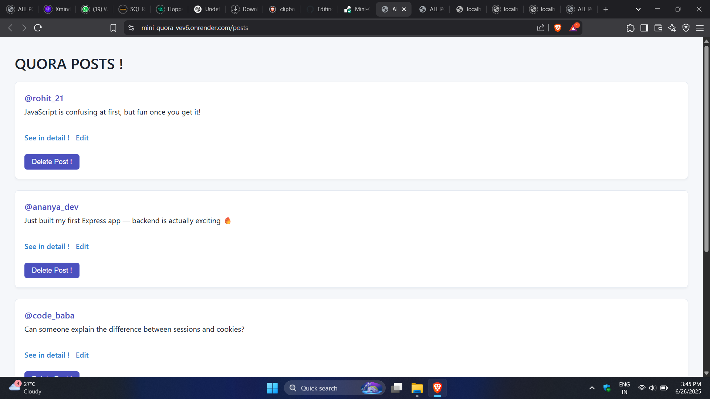

# 📝 Quora-Style Posts Interface

A basic Quora-style web app built with **Express.js**, **EJS**, and **RESTful APIs**.  
It supports creating, editing, deleting, and viewing posts using server-side rendering.

---

## 🔍 Features

- View all posts
- Create new post
- Edit & delete existing posts

---

## 🖼️ Screenshots

<p align="center">
  
  
  <br>
  
  
</p>

## 🚀 Run Locally

```bash
git clone https://github.com/atharvak-3000/Mini-Quora.git
cd Mini-Quora
npm install
node index.js
```
App runs at: `http://localhost:8080`

## 🔗 Live Site
[👉 Click here to view live !](https://mini-quora-vev6.onrender.com)

---

## ⚙️ Stack

- Express.js
- EJS
- REST APIs
